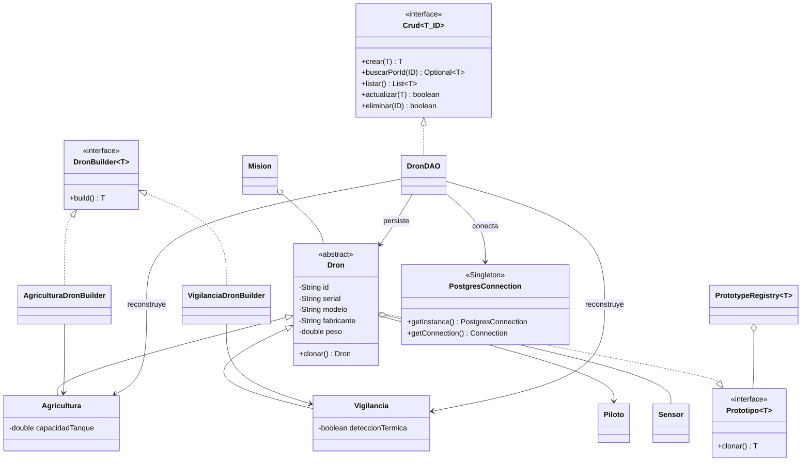

# Diagrama de clases corregido

El archivo fuente editable es `diagrama-clases.puml`. Las dependencias de
`DronDAO` se conectan directamente con `Dron`, `Agricultura`, `Vigilancia` y
`PostgresConnection`, aunque pertenezcan a paquetes distintos.

